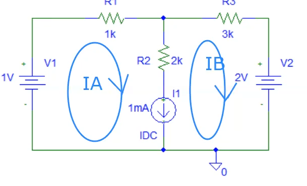
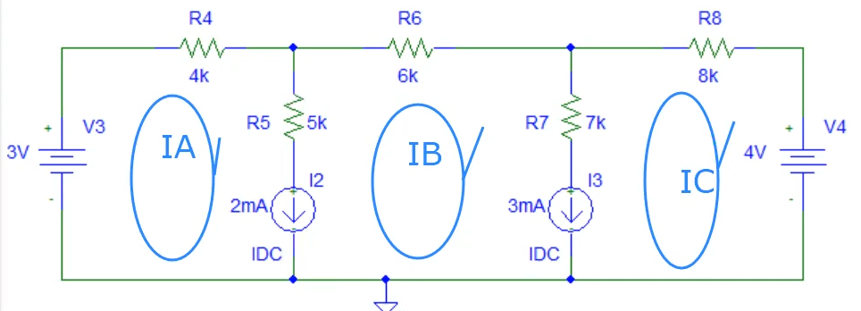
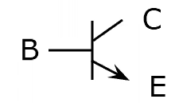
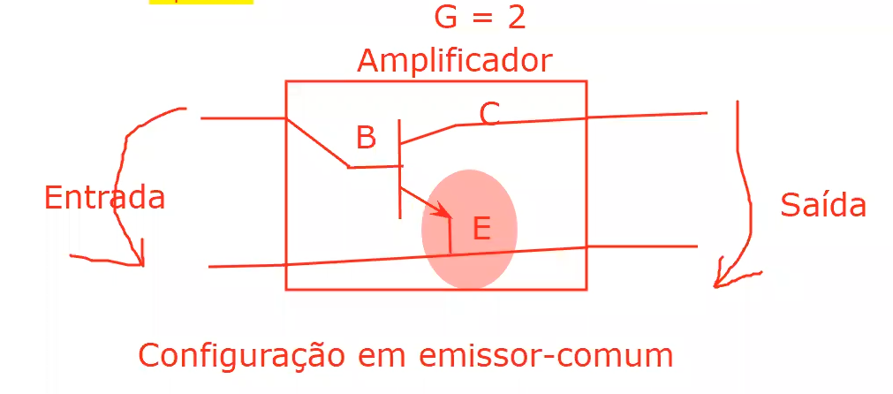

[voltar](../README.md)
# Estudo de Eletro

## Aulas Teoricas

### Aula 3

    1. Componentes
        
        a. Passivos - Retiram energia ao circuito (transformando em)
        
            i. Resistencia (calor)


            ii. Condensador (campo eletrico)

            
            iii. Bobine (campo magnetico)   


        b. Activos - Fornecem energia ao circuito
        
            i. Fontes de tensão

            
            ii. Fontes de corrente


    2. Análise Circuitos
        
        1. Circuitos Simples (circuitos com uma fonte)
        
            a. Ferramentas:
                
                i. Fórmula do divisor de tensão.


                ii. Fórmula do divisor da corrente.
                

                
                iii. Associaão de resistências.
                    
                    Resistências em série.


                    Resistências em paralelo.


                        
                    
            

### Aula 4

**Lei dos nós**

O sumatorio das correntes que entram é igual ao sumatirio das correntes que saiem de um nó.


**Lei das Malhas**

O sumatorio das quedas de tensão numa malha é nulo.


    1. Circuitos Complexos


        a. Técnicas de análises  de circuitos
        
            i. Método direto
            
           

 
                
            ii. Método das malhas
            


            iii. Métodos nodais


            
### Aula 5

#### Análise de circuitos complexos: Casos particulares
        
    Conceito de super-malha: 


Quando entre duas malhas simples existe um ramo com uma fonte de corrente.
    
- Aplicar método das malhas
    
- Aplicar a lei das malhas à super-malha.

- Relacionar as correntes de malha com a corrente do ramo contido na super-malha.

    Resolvendo

    * 1º Super-malha:
    
        

        
        
        $$ - V1 + R1 · IA + R3 * IB + V2 = 0   $$ (1)
        

        $$ I1 = IA - IB    $$ (2)
        


    - 2º Super-Malha:
    
        

        $$ - V3 + R4 · IA + R6 · IB + R8 · IC + V4 = 0 $$(1)

        $$ I2 = IA - IB $$(2)

        $$ I3 = IB - IC $$(3)

- **Conceito de super-nó:**

    Quando entre dois nós essenciais existe um ramo com uma fonte de tensão.

  - Aplicar método das tensões nodais.
  - Aplicar a lei dos nós ao super-nó.
  - Relacionar as quedas de tensão nodal com a tensão nodal com a tensão entre os nós que compõem o super-nó.
  
**Super-nós:**

- **UM SUPER-NÓ NÃO PODE SER NÓ DE REFERÊNCIA**

        Super-nó:

    


### Aula 6 - Teoremas de simplificaão de circuitos (sistemas lineares)

- **Teorema de Thevenin** - permite converter um circuito complexo num circuito simples composto por uma fonte de tensão (tensão de thevenin) e uma resistência (resistência de thevenin).

- **Teorema de sobreposição** - permite converter um circuito complexo num conjunto de diversos circuitos simples.

    -   Analisar cada um dos ciruitos simples.
    -   Adicionar os contributos individuais de cada circuito simples.


Sistema de eletrónico (fonte de tensão, fontes de corrente, resistências, condesadores e as bobinas).

- Memória.

- Establidade.

- Causais.

- Linearidade ( fontes de tensão, fonte de corrente e resistências)
    
    um circuito com um díodo ou transistors é um exemplo de um circuito não linear porque pode ou não transportar corrente dependendo da corrente/volagem

    
    - Exemplo
        
        

### Aula 7 - Explicação teorica de diodos

[Wikipedia - Diodo semicondutor](https://pt.wikipedia.org/wiki/Diodo_semicondutor)

### Aula 8 - Analise de circuitos com diodos


Análise de circuitos com díodos: 

**1º Identificar o nº máximo de estados.**

Nº máximo de estados é 2 elevados ao numero de díodos

Exemplos:

- 1 díodo = 2¹ = 2 ESTADOS
    
    1. Diodo conduz

    2.  Diodo n/conduz

- 2 díodos (D1,D2) = 2² = 4 ESTADOS

    1.  D1 conduz e D2 conduz

    1.  D1 conduz e D2 n/conduz

    1.  D1 n/conduz e D2 n/conduz

    1.  D1 n/conduz e D2 conduz
    
**2º Analisar todos os estados de forma individual**

1. Começar por analisar o estado em que mais dóiodos conduzem.

    1. Impor a condução do díodo (partir do pressuposto que o díodo conduz)

    2. Substituir o díodo pelo circuito equivalente em condução.

    3. Impor o sentido correto para a corrente.A corrente no díodo deve ter o sentido do ânodo para o cátodo.

    4. Impor a condição : Id > 0 -> obter a condição que determina a condução do díodo. Qual o valor da tensão de entrada que garante a condução do díodo.

        Identificar para que valores de tensão de entrada o díodo conduz.

    5. Relacionar a tensão de saída com a tensão de entrada (função transferência.)

2.  agregar os valores das equações/ condições obtidas para cada um dos estados numa só equação não linear - função transferência analítica.

3. Representar graficamente a função transferência.

4. representação temporal das formas de onda da tensão de entrada e de saída.

### Aula 9 - Continuação da aula 8

Análise de circuito com díodos (fontes de tensão alternada)

1. Identificar o nº de estados.
    
    1. Nº máximo de estados = 2 ^ (nº de díodos)
    
    2. Analisar individualmente todos os estados.
    
3. Começar por analisar o estado em que o díodo conduz (partir do pressuposto que o díodo conduz).
        
    1.  Substituir o díodo pelo circuito equivalente em condução
    
    
    
    2.  Impor o sentido correto para a corrente (A -> K)
    
    3.  Analisar o circuito utilizando a lei das malhas.
    
        

        Rd = 100Ω
        
        Vo = 0,7V
        
    
    4. Relacionar a corrente do díodo (id) com a tensão de entrada do círcuito (vin).
        
        1. Substituir o díodo pelo circuito equivalente em n/condução.
        
        2. Analisar o circuito utilizando a lei das malhas.
        
        3. Determinar para que valores de vin o díodo n/conduz.
        
        4. Relacionar a tensão de sáida (vout) com tensão de entrada (Funcão tranferência)

    5. Juntar ambas as equações numa equação não  linear → função transferência analítica.
    
    6. Representar a função transferência graficamente.
    
    7. Representar as formas de onda da tensão de entrada e saída em função do tempo.
    
    
### Aula 10 - Transistors

Díodos e resistência:

- Passivos.

- Dois terminais.

Transístores:

- Ativos.

- Três terminais

- Aplicações (transistores):

    - Linear (potenciómetro controlado eletronicamente).
        
        - Fontes de alimentação lineares.
                
            É um dispositivo que limita a tensão, por exemplo podemos usar a divisão de tensão para obter uma fonte de 5V a partir de uma fonte de 12V com resistencias desta forma (graças ao divisor da tensão):
            
            
            
            A resistencia da fonte tem de ser ajustada diacordo com a resistencia do dispositivo divital para que se de sempre 5V
            
            
            
            Para tal usa se o transistor para comtrolar digitalmente a reistencia R1.
            
            
                
        * Amplificador
           
           
        
    - Corte/saturação ( interruptor ).
        - Fontes de alimentação comutadas.
        - Amplificadores comutadas ( classe D ).
        - Dispositivos digitais ( AND , OR , NOT , NAND , NOR ). 
    
      
- Transístores:
        
    - MOSFET - transístor de efeito de campo de óxido metálico semicondutor.
        
        Simbolo:
        
        
        
        Exemplo Funcional:
        
        
        
        - Ganho é reduzido ( não é uma boa solução para amplificadores).
        - Perdas reduzindas na comutação (interruptor).
    - BJT - transístor de bipolar de junção.
        - Ganho é mito elevado ( é uma boa solução para amplificadores )
        - Perdas elevadas na comutação ( não é uma boa solução para operar como interruptor )

    - Transístores Bipolares:
        - NPN
            
            Simbolo:
            
            
            
            Estrutura:
            
            
        
        - PNP

            Simbolo:
        
            

            Estrutura:

            
            
            
        - Discriçào:
        
            Emissor: fortemente dopada e de dimensão intermédia - emite.
            
            Base: fracamente dopada e de dimensão muito reduzida.
            
            Coletor: Dopagem intermédia e de dimensão muito grande.
            
    - Transístores BJT
        - Díodo emissor
        - Díodo coletor
        
    - Polarização - aplicação de uma tensão aos díodos (DE e DC) que compõe o transístor

        - DE e DC diretamente polarizado - região de saturação (interruptor fechado)

        - DE e DC inversamente polarizado - região de corte (interruptor aberto)

        - DE diretamente polarizado e  o DC inversamente polarizado - região ativa (linear) - amplificador.
        
    - Amplificador com transístor BJT (configurador):

        
            
    - Curva caracteristica transístor BJT na configuração em emissor-comum:
    
        1. Entrada
            
            A curva caracteristica é de um díodo porque é uma relação B com E
        
        2. Saída
        
### Aula 11 - Simulações de transístors


Simulações:

- Circuitos
    
    
    
- Calculos
    
    
    
    
    
### Aula 12 - Analise de Amplificadores


### Aula 13 - Amp-Op

 

## Aulas Praticas

### Aula 4 Ex 8

#### a) Metodo direto

##### **I**. Identificar nós essenciais

Existem 4 nós essenciais

##### **II**. Aplicar a lei dos nós a n-1 nós essenciais

| Nó | Expressão |
|------|:-----------------:|
| A |  I1 + I2 + I3 = 0 |
| B | I3 = I5 + I4 |
| C | I2 + I4 = I6 |

##### **III**. Aplicar a lei das malhas às malhas simples

| malha | Expressão |
|------|:-----------------:|
| m1 |  25·I2 - 10·I4 - 5·I3 = 0 |
| m2 | 10·I4 + 8·I6 - 70·I5 = 0 |
| m3 | 70·I5 - 180 + 5·I3 = 0 |


##### **IV.** Fazer a matriz conjunta

| I1 | I2 | I3 | I4 | I5 | I6 |  |
|:--:|:--:|:--:|:--:|:--:|:--:|:--:|
| 1·I1 | 1·I2 | 1·I3 | 0 | 0 | 0 | = 0 
| 0 | 0 | -1·I3 | 1·I4 | 1·I5 | 0 | = 0 
| 0 | 1·I2 | 0 | 1·I4 | 0 | -1·I6 | = 0 
| 0 | 25·I2 | -5·I3 | -10·I4 | 0 | 0 | = 0 
| 0 | 0 | 0 | 10·I4 | -70·I5 | 8·I6 | = 0 
| 0 | 0 | 5·I3 | 0 | 70·I5 | 0 | = 180 

##### **V.** Meter tudo no scilab/matlab/octave

**Setup dos dados:**

```octave
A = [ 
  1 1 1 0 0 0
  0 0 -1 1 1 0 
  0 1 0 1 0 -1  
  0 25 -5 -10 0 0 
  0 0 0 10 -70 8 
  0 0 5 0 70 0
]

 b = [0;0;0;0;0;180]
```

**Como obter os resultados:**

$$ A · x  = b $$ (1) 
sendo x as incognitas I*X* como I1, I2 etc
$$ x = b / A $$ (2)

$$ x = 1 / A * b $$ (3)

$$ x = A^(-1) * b $$ (4)


logo na formula da calculadora escrevemos `A^-1 * b`

e assim obtemos:

I1 = -12

I2 = 4

I3 = 8

I4 = 6

I5 = 2

I6 = 10

##### **VI.** Solução

P = V·I1 = 180·I1 = 180·12 = 2160W = 2.16 kW

#### b) Metodo das malhas

##### **I.** Identificar as malhas simples


##### II. Identificar correntes fictícias (correntes de malha)


##### III. Aplicar a lei das malhas às malhas simples

m1 : 25·I1 + 10·(I1-I3) + 5·(I1 - I2) = 0

m2: 5·(I2 - I1) + 70·(I2 - I3) - 180 = 0
 
m3: 10·(I3 - I1) + 8·(I3) + 70·(I3 - I2) = 0

| I1 | I2 | I3 | |
|:-:|:-:|:-:|:-:|
|25+10+5(40) | - 5 | - 10 | = 0
| -5 | 5+70(75) | -70 | = 180
| -10 | -70 | 10+8+70(88) | = 0

##### IV. Calculos

```octave
A = [
   40 -5 -10 
   -5 75 -70 
   -10 -70 88 
] 

b = [0;180;0]

resultado = A^-1 * b
```

###### Resultados
```octave
 resultado  = 

   4. 
   12.
   10.
```

I1 = 4A
I2 = 12A
I3 = 10A

P = -V·I2 = -180 · 12 = -2160W = -2.16kW

#### c) Metodo das tensões nodais

##### I. Identificar nós essenciais


##### II. Identificar nó de referência (nó com + ligações)
É o nó D.

##### III. Identificar tensões nodais (quedas de tensão dos nós essenciais não de referência para o nó de referência)


##### IV. Aplicar a lei dos nós aos nós essenciais não de referência


Nó A: I1 + I2 + I3 = 0
Nó B: I3 = I5 + I4
Nó C: I5 + I2 = I6

##### V. Relacionar as correntes com as tensões nodais (Lei das malhas)

I1 = ? → VA = 180


25 · I2 + VC - VA = 0 →  I2 = ( VA - VC ) / 25

5 · I3 + VB - VA = 0 → I3 = ( VA - VB ) / 5

I4 = VB / 70

10 · I5 + VC - VB = 0 → I5  = ( VB - VC ) /  10

I6 = VC / 8

##### VI. Substituir correntes pelas tensões nodais (substituir V em IV)


**Nó A:** 

I1 + ( VA - VC ) / 25 + ( VA - VB ) / 5 = 0

<=> I1 + VA/25 - VC/25 + VA/5 - VB/5 = 0

<=> I1  - VB/5  - VC/25 = -180·(1/25+ 1/5)


**Nó B:** 

( VA - VB ) / 5 = ( VB - VC ) /  10 + VB / 70 <=>

<=> VA/5 -VB/5 = VB/10 - VC/10 + VB/70

<=> VA/5 + VB·(-1/5 - 1/10 - 1/70) + VB/10 = 0

<=> VB·(-1/5 - 1/10 - 1/70) + VB/10 = -180/5


**Nó C:** 

( VB - VC ) /  10 + ( VA - VC ) / 25 = VC / 8 <=>

<=> VB/10 - VC/10 + VA/25 - VC/25 = VC/8 <=>

<=> VA/25 + VB/10 + VC·( -1/10 -1/25 - 1/8) = 0 <=>

<=> VB/10 + VC·( -1/10 -1/25 - 1/8) = -180/25


##### VII. Calculos e resultados


```octave
A = [ 
  1 -1/5 -1/25 
  0 -1/5-1/10-1/70 1/10 
  0 1/10 -1/10-1/25-1/8 
] 

b = [ 
  -180*(1/25+1/5) 
  -180/5 
  -180/25 
] 

resultado = A^-1*b

```

I1 = -12
I2 = 140
I3 = 80

P - V·I1 = 180 · (- 12) = -2160 W = -2.16 kW

