> # **Aulas Teoricas**

# Aula 3

    1. Componentes
        
        a. Passivos - Retiram energia ao circuito (transformando em)
        
            i. Resistencia (calor)
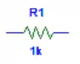

            ii. Condensador (campo eletrico)

            
            iii. Bobine (campo magnetico)   

        b. Activos - Fornecem energia ao circuito
        
            i. Fontes de tensão
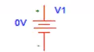
            
            ii. Fontes de corrente

    2. Análise Circuitos
        
        1. Circuitos Simples (circuitos com uma fonte)
        
            a. Ferramentas:
                
                i. Fórmula do divisor de tensão.
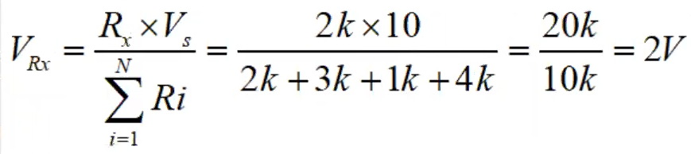

                ii. Fórmula do divisor da corrente.
                
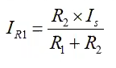
                
                iii. Associaão de resistências.
                    
                    Resistências em série.
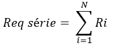

                    Resistências em paralelo.

                        
                    
            

### Aula 4

**Lei dos nós**

O sumatorio das correntes que entram é igual ao sumatirio das correntes que saiem de um nó.

**Lei das Malhas**

O sumatorio das quedas de tensão numa malha é nulo.

    1. Circuitos Complexos

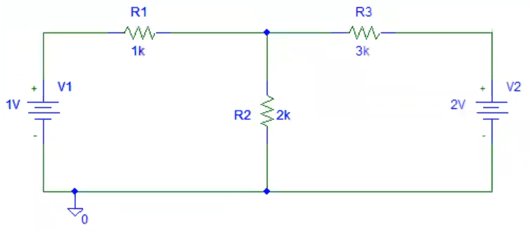

        a. Técnicas de análises  de circuitos
        
            i. Método direto
            
           

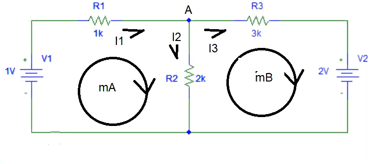 
                
            ii. Método das malhas
            

            iii. Métodos nodais

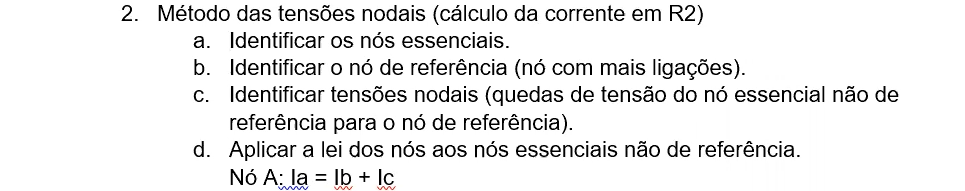

            
### Aula 5

#### Análise de circuitos complexos: Casos particulares
        
    Conceito de super-malha: 

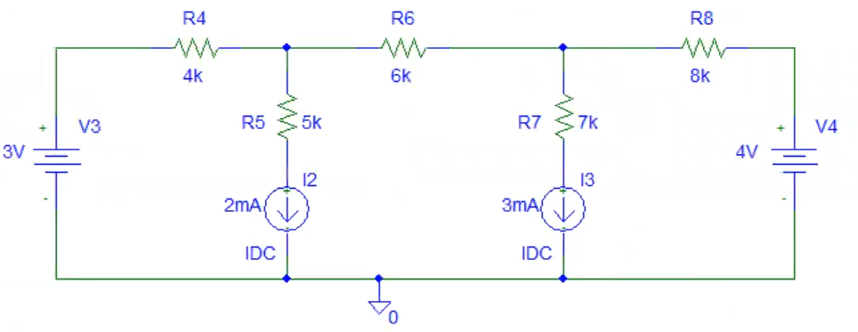

Quando entre duas malhas simples existe um ramo com uma fonte de corrente.
    
- Aplicar método das malhas
    
- Aplicar a lei das malhas à super-malha.

- Relacionar as correntes de malha com a corrente do ramo contido na super-malha.

    Resolvendo

    * 1º Super-malha:
    
        

        
        
        $- V1 + R1 · IA + R3 * IB + V2 = 0$ (1)
        

        $I1 = IA - IB$ (2)
        

    - 2º Super-Malha:
    
        

        $- V3 + R4 · IA + R6 · IB + R8 · IC + V4 = 0$ (1)

        $I2 = IA - IB$(2)

        $I3 = IB - IC$(3)

- **Conceito de super-nó:**

    Quando entre dois nós essenciais existe um ramo com uma fonte de tensão.

  - Aplicar método das tensões nodais.
  - Aplicar a lei dos nós ao super-nó.
  - Relacionar as quedas de tensão nodal com a tensão nodal com a tensão entre os nós que compõem o super-nó.
  
**Super-nós:**

- **UM SUPER-NÓ NÃO PODE SER NÓ DE REFERÊNCIA**

        Super-nó:

    

### Aula 6 - Teoremas de simplificaão de circuitos (sistemas lineares)

- **Teorema de Thevenin** - permite converter um circuito complexo num circuito simples composto por uma fonte de tensão (tensão de thevenin) e uma resistência (resistência de thevenin).

- **Teorema de sobreposição** - permite converter um circuito complexo num conjunto de diversos circuitos simples.

    -   Analisar cada um dos ciruitos simples.
    -   Adicionar os contributos individuais de cada circuito simples.

Sistema de eletrónico (fonte de tensão, fontes de corrente, resistências, condesadores e as bobinas).

- Memória.

- Establidade.

- Causais.

- Linearidade ( fontes de tensão, fonte de corrente e resistências)
    
    um circuito com um díodo ou transistors é um exemplo de um circuito não linear porque pode ou não transportar corrente dependendo da corrente/volagem

    
    - Exemplo
        
        

### Aula 7 - Explicação teorica de diodos

[Wikipedia - Diodo semicondutor](https://pt.wikipedia.org/wiki/Diodo_semicondutor)

### Aula 8 - Analise de circuitos com diodos

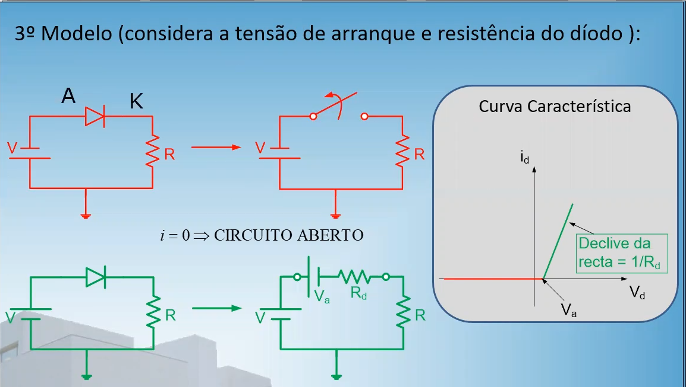

Análise de circuitos com díodos: 

**1º Identificar o nº máximo de estados.**

Nº máximo de estados é 2 elevados ao numero de díodos

Exemplos:

- 1 díodo = 2¹ = 2 ESTADOS
    
    1. Diodo conduz

    2.  Diodo n/conduz

- 2 díodos (D1,D2) = 2² = 4 ESTADOS

    1.  D1 conduz e D2 conduz

    1.  D1 conduz e D2 n/conduz

    1.  D1 n/conduz e D2 n/conduz

    1.  D1 n/conduz e D2 conduz
    
**2º Analisar todos os estados de forma individual**

1. Começar por analisar o estado em que mais dóiodos conduzem.

    1. Impor a condução do díodo (partir do pressuposto que o díodo conduz)

    2. Substituir o díodo pelo circuito equivalente em condução.

    3. Impor o sentido correto para a corrente.A corrente no díodo deve ter o sentido do ânodo para o cátodo.

    4. Impor a condição : Id > 0 -> obter a condição que determina a condução do díodo. Qual o valor da tensão de entrada que garante a condução do díodo.

        Identificar para que valores de tensão de entrada o díodo conduz.

    5. Relacionar a tensão de saída com a tensão de entrada (função transferência.)

2.  agregar os valores das equações/ condições obtidas para cada um dos estados numa só equação não linear - função transferência analítica.

3. Representar graficamente a função transferência.

4. representação temporal das formas de onda da tensão de entrada e de saída.

### Aula 9 - Continuação da aula 8

Análise de circuito com díodos (fontes de tensão alternada)

1. Identificar o nº de estados.
    
    1. Nº máximo de estados = 2 ^ (nº de díodos)
    
    2. Analisar individualmente todos os estados.
    
3. Começar por analisar o estado em que o díodo conduz (partir do pressuposto que o díodo conduz).
        
    1.  Substituir o díodo pelo circuito equivalente em condução
    
    
    
    2.  Impor o sentido correto para a corrente (A -> K)
    
    3.  Analisar o circuito utilizando a lei das malhas.
    
        

        Rd = 100Ω
        
        Vo = 0,7V
        
    
    4. Relacionar a corrente do díodo (id) com a tensão de entrada do círcuito (vin).
        
        1. Substituir o díodo pelo circuito equivalente em n/condução.
        
        2. Analisar o circuito utilizando a lei das malhas.
        
        3. Determinar para que valores de vin o díodo n/conduz.
        
        4. Relacionar a tensão de sáida (vout) com tensão de entrada (Funcão tranferência)

    5. Juntar ambas as equações numa equação não  linear → função transferência analítica.
    
    6. Representar a função transferência graficamente.
    
    7. Representar as formas de onda da tensão de entrada e saída em função do tempo.
    
    
### Aula 10 - Transistors

Díodos e resistência:

- Passivos.

- Dois terminais.

Transístores:

- Ativos.

- Três terminais

- Aplicações (transistores):

    - Linear (potenciómetro controlado eletronicamente).
        
        - Fontes de alimentação lineares.
                
            É um dispositivo que limita a tensão, por exemplo podemos usar a divisão de tensão para obter uma fonte de 5V a partir de uma fonte de 12V com resistencias desta forma (graças ao divisor da tensão):
            
            
            
            A resistencia da fonte tem de ser ajustada diacordo com a resistencia do dispositivo divital para que se de sempre 5V
            
            
            
            Para tal usa se o transistor para comtrolar digitalmente a reistencia R1.
            
            
                
        * Amplificador
           
           
        
    - Corte/saturação ( interruptor ).
        - Fontes de alimentação comutadas.
        - Amplificadores comutadas ( classe D ).
        - Dispositivos digitais ( AND , OR , NOT , NAND , NOR ). 
    
      
- Transístores:
        
    - MOSFET - transístor de efeito de campo de óxido metálico semicondutor.
        
        Simbolo:
        
        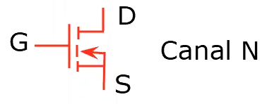
        
        Exemplo Funcional:
        
        
        
        - Ganho é reduzido ( não é uma boa solução para amplificadores).
        - Perdas reduzindas na comutação (interruptor).
    - BJT - transístor de bipolar de junção.
        - Ganho é mito elevado ( é uma boa solução para amplificadores )
        - Perdas elevadas na comutação ( não é uma boa solução para operar como interruptor )

    - Transístores Bipolares:
        - NPN
            
            Simbolo:
            
            
            
            Estrutura:
            
            
        
        - PNP

            Simbolo:
        
            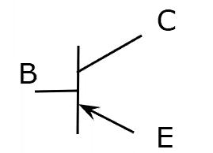

            Estrutura:

            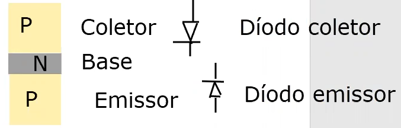
            
            
        - Discriçào:
        
            Emissor: fortemente dopada e de dimensão intermédia - emite.
            
            Base: fracamente dopada e de dimensão muito reduzida.
            
            Coletor: Dopagem intermédia e de dimensão muito grande.
            
    - Transístores BJT
        - Díodo emissor
        - Díodo coletor
        
    - Polarização - aplicação de uma tensão aos díodos (DE e DC) que compõe o transístor

        - DE e DC diretamente polarizado - região de saturação (interruptor fechado)

        - DE e DC inversamente polarizado - região de corte (interruptor aberto)

        - DE diretamente polarizado e  o DC inversamente polarizado - região ativa (linear) - amplificador.
        
    - Amplificador com transístor BJT (configurador):

        
            
    - Curva caracteristica transístor BJT na configuração em emissor-comum:
    
        1. Entrada
            
            A curva caracteristica é de um díodo porque é uma relação B com E
        
        2. Saída
        
### Aula 11 - Simulações de transístors

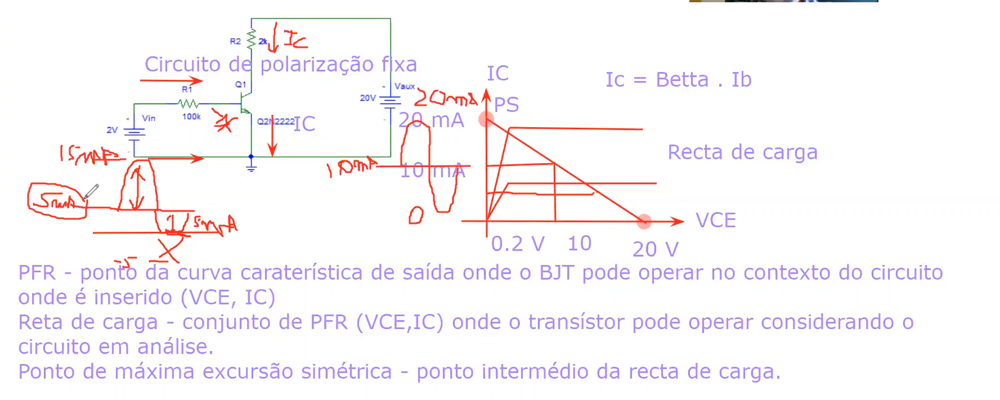

Simulações:

- Circuitos
    
    
    
- Calculos
    
    
    
    
    
### Aula 12 - Analise de Amplificadores

### Aula 13 - Amp-Op

 

