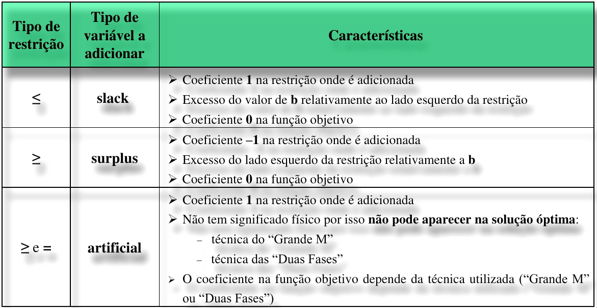
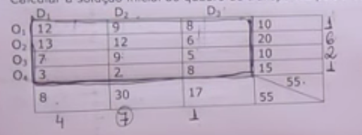
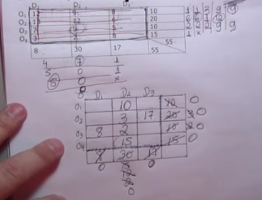

[voltar](../index.html)
# **Programação Linear**

## Capitulo 1 - Introdução

## **Exemplo 1**

**Problema:**

>Uma empresa de calçado produz botas do tipo A e do tipo B.
>
>Todas as botas passam pelo controle de qualidade após o processo de acabamento.
>
>O depoartamento de acabamento tem capacidade para 80 horas/semana e no controle de qualidade estão disponíveis 120 horas/semana.
>
>Cada par de botas do tipo A demora 1 hora no processo de acabamento e 3 horas no controle de qualidade. 
>
>Cada par de botas do tipo B demora 2 horas no processo de acabamento e 2 horas no controle de qualidade.
>
>As botas do tipo A são vendidas a 80€/par e as botas do tipo B a 70€/par.
>
>Supondo que é vendida toda a produção, quantos pares de botas do tipo A e do tipo B devem ser produzidos por semana para a empresa obter rendimento máximo?

- Dados:
  - O departamento tem:
      - 80 horas/semana de capacidade para o acabamento
      - 120 horas/semana disponíveis para o controlo de qualidade
  - Tipos de sapatos:
    - A
      - 1 hora no processo de acabamento
      - 3 horas no controle de qualidade
    - B
      - 2 horas processo de acabamento
      - 2 horas no controlo de qualidade
- Objetivo:
  - quantos pares de botas do tipo A e B devem ser produzos por semana para a empresa obter rendimento máximo

### **Resuloção**

1. Descobrir as variaveis
    - $x \rightarrow$ nº de pares de botas do tipo A produzidos por semana  
    - 
    - $y \rightarrow$ nº de pares de botas do tipo B produzidos por semana
2. Definir função Objetivo ou função Lucro
    - $L(x,y) = 80x+70y$ 
       - sendo L o lucro(em euros) derivado de x(botas A) e y(botas B), valendo cada par 80 e 70 respectivamente
3. Encontrar as restrições do problema
   - $\begin{cases}
        x \ge 0 \\
        y \ge 0 \\
        x + 2y \le 80 &\text{(1)} \\
        3x+2y \le 120 &\text{(2)} \\
        x,y \isin \N _{0}\\
    \end{cases}$
4. Região admissível e Solução ótimas
   - $S = (x,y)=(?,?)$

(1) 
>   $x+2y \le 80 \\
    2y \le -x + 80 \\
    \textcolor{green}{\boxed{y \le - \frac{1}{2} x + 40 }}$

(2)
>   $3x+2y \le 120 \\
>   2y \le -3x + 120 \\ 
>   \textcolor{green}{\boxed{ y \le - \frac{3}{2} x + 60}}$

com estes temos as retas, em que basta igualar as variaveis a 0 para termos onde colidem com os eixos obtendo assim


depois aplicamos os limites:


Como o que nos interessa é só o que está na intercesão no que não o faz ficando com:


Sabemos que a solução otima esta num dos vertices da area selecionada tendo assim os seguintes 4 pontos:


Descobre o ponto de interseção:

$$
\begin{cases}
  y \le - \frac{1}{2} x + 40 \\
  y \le - \frac{3}{2} x + 60
\end{cases}
  \underbrace{\Rightarrow}
  _{\text{Como so se quer a interseção dos pontos }}
\begin{cases}
  y = - \frac{1}{2} x + 40 \\
  y = - \frac{3}{2} x + 60
 \end{cases}
 \Leftrightarrow
$$

$$
\Leftrightarrow
\begin{cases}
  - \frac{3}{2} x + 60 = - \frac{1}{2} x + 40 \\
  y = - \frac{3}{2} x + 60
 \end{cases}
 \Leftrightarrow
 \begin{cases}
  \frac{3}{2} x - \frac{1}{2} x = 20 \\
  y = - \frac{3}{2} x + 60
 \end{cases}
 \Leftrightarrow
 \begin{cases}
  x = 20 \\
  y = - \frac{3}{2} x + 60
 \end{cases}
 \Leftrightarrow
$$

$$
 \Leftrightarrow
 \begin{cases}
  x = 20 \\
  y = - \frac{3}{2} 20 + 60
 \end{cases}
 \Leftrightarrow
 \begin{cases}
  x = 20 \\
  y =  60-30
 \end{cases}
\Leftrightarrow
 \begin{cases}
  x = 20 \\
  y = 30
 \end{cases}
$$

agora faz-se uma tabela:

| x   | y   | $L(x,y) = 80x+70y$ |
| --- | --- | ------------------ |
| 0   | 0   | 0                  |
| 40  | 0   | 3200               |
| 0   | 40  | 2800               |
| 20  | 30  | 3700               |

> **Resposta:** Para a empresa obter o rendimento máximo esta deve ser produzido *20 pares do tipo A* e *30 do tipo B*.

<!-- ## Capitulo 2 - O Modelo de Programação Linear +-->

# O Metodo Simplex

O método Simplex é um procedimento genérico que nos possiblita resolver problemas de programação linear.

É um método algébrico, no qual em cada iteraço, se resolve um sistema de equações de forma a ober uma solução a ser testada:

Considere as seguntes  definições:
> Um **ponto extremo (PE)** é um ponto que resulta do cruzamento de quaisquer duas das restrições.
> Se pertencer à região admissível é um **PE** admissível, caso contrário é um **PE** não admissível.
> Dois **PE**s admissíveis são adjacentes se estiverem ligados por uma única aresta na região admissível.

Assume-se que:
 - O modelo está na forma *standard*
   - maximizar z = **c'x**
   - sujeito a 
     - Ax≤b
     - x>0
   - bi≥0,$\forall$i


Add das variaveis slack para turnar as desigualdades em igualdades

$Ax≤b \underbrace{\Leftrightarrow}_\text{+"slacks"} Ax=b$

As soluções que resultam da resolução do sistema $Ax=b$ designam-se por style **suluções básicas** (**SB**s).
Num problema com n variáveis e m restrições, uma solução básica é constituída por:
  - **m** variáveis básicas(**VA**) - valor diferente de zero
  - **n** variáveis não básicas (**VNB**s) - valor igual a zero

> Uma **solução básica** é **admissível** se todos os valores das variáveis que a constituem forem **≥0**. Caso contrário, diz-se **não admissível**.

A cada solução básica corresponde um ponto extremo no gráfico:
  $$\text{\textbf{PE} admissível }\leftrightarrow \text{\textbf{SB} admissível (ou \textbf{SBA}) }$$
$$\text{\textbf{PE} não admissível }\leftrightarrow \text{\textbf{SB} não admissível (ou \textbf{SBNA}) }$$

> Duas **SBA**s são adjacentes se diferirem apenas numa **VNB**
> 
>   $$\downarrow$$
>
> Significa que passar de uma **SBA** para outra **SBA** adjacente corresponde a trocar uma **VNB** com uma **VB** (e vice-versa)
> 


### Algoritmo do método Simplex

1. **Inicialização**: Como selecionar o PE admissível inicial?
   
   Qualquer PE admissível pode ser adotado como solução inicial:
     - antes da intodução das "slacks": origem;
     - após a introdução das "slacks": variáveis originais são VNBs e as "slacks" são VBs;
     - valor nulo para a função objetivo.
2. **Teste de otimalidade**: Como determinar se o PE admissível actual não tem PEs admissíveis adjacentes melhores?
   Em termos genéricos, o PE admissível  corrente é óptimo se e só se não existir nenhum PE admissível adjacente que melhore o valor da função objetivo, ou seja, se a entrada de uma VNB na base não se repercutir num aumento do valor da função objetivo.
3. **Iteração**: Como mover-se para um melhor PE admissível adjacente?
   1. Como selecionar a direão do movimento?
      - As candidatas a a entrar na base são as VNB
        - Os vetores atividade correspondentes às VB são unitários e learmente independentes;
   2. Onde parar?
   3. Como identificar a nova solução?
   

#### Exemplo 1 - Source: [Método Simplex - aula 2](https://www.youtube.com/watch?v=B2C5GQM3YB4)

$Máx L = 4x_1 + x_2$

Sujeito a:
  - $2x_1 + 3x_2 ≤ 12$
  - $2x_1 + x_2 ≤ 8$
  - $x_1 , x_2 ≥ 0$

$z - 4x_1 - x_2 = 0$

$2x_1 + 3x_2 + xF_1 = 12$

$2x_1 + x_2 + xF_2 = 8$

| Linha | $z$ | $x_1$ | $x_2$ | $xF_1$ | $xF_2$ | $b$ |
| ----- | --- | ----- | ----- | ------ | ------ | --- |
| 1     | 1   | -4    | -1    | 0      | 0      | 0   |
| 2     | 0   | 2     | 3     | 1      | 0      | 12  |
| 3     | 0   | 2     | 1     | 0      | 1      | 8   |


buscar o numero mais negativo para ser a coluna que entra sendo essa neste caso a coluna do $x_1$,tem se o -4 que é **o número negativo de maior valor absoluto(em módulo)** sendo assim a variável que entra é o $x_1$

| Linha |  $z$  | $x_1$  | $x_2$ | $xF_1$ | $xF_2$ |  $b$  |
| :---: | :---: | :----: | :---: | :----: | :----: | :---: |
|   1   |   1   | **-4** |  -1   |   0    |   0    |   0   |
|   2   |   0   | **2**  |   3   |   1    |   0    |  12   |
|   3   |   0   | **2**  |   1   |   0    |   1    |   8   |


agora identificando a variavél que sai, que obtem dividindo as variaveis independentes ($b$) pelos valores da variável que entra (relembrando que a linha da função objetivo):
  
  12/2 = 6

  8/2=4

**o menor valor positivo sera a linha que saí** logo é a terceira linha a pivó

| Linha |  $z$  |  $x_1$  | $x_2$ | $xF_1$ | $xF_2$ |  $b$  |
| :---: | :---: | :-----: | :---: | :----: | :----: | :---: |
|   1   |   1   | **-4**  |  -1   |   0    |   0    |   0   |
|   2   |   0   |  **2**  |   3   |   1    |   0    |  12   |
|   3   | **0** | ***2*** | **1** | **0**  | **1**  | **8** |

o elemento pivo é aquele que esta na interseção da linha que e sai e da coluna que entra, logo, neste caso, é o ***2*** da linha 3 e variavel $x_1$

**Criação da nova linha pivo(e terceira linha):**
Primeiro mete se a linha sai e divide se pelo numero pivo (2):
|       |  $z$  | $x_1$ | $x_2$ | $xF_1$ | $xF_2$ |  $b$  |
| :---: | :---: | :---: | :---: | :----: | :----: | :---: |
|  /2   |   0   |   2   |   1   |   0    |   1    |   8   |
|       |   0   |   1   |  1/2  |   0    |  1/2   |   4   |

Depois multiplica a nova linha pivo pelo negativo pertencente a coluna que entra, fazendo isto linha a linha para obter as novas linhas

no caso da **primeira linha** o numero pelo que vamos multiplicar é o -4, como dito anteriormente negamos esse valor(-4 ⇒ 4)
  |       |  $z$  | $x_1$ | $x_2$ | $xF_1$ | $xF_2$ |  $b$  |
  | :---: | :---: | :---: | :---: | :----: | :----: | :---: |
  |  4 *  |   0   |   1   |  1/2  |   0    |  1/2   |   4   |
  |       |   0   |   4   |   2   |   0    |   2    |  16   |

e depois soma se essa linha:
  |       |  $z$  | $x_1$ | $x_2$ | $xF_1$ | $xF_2$ |  $b$  |
  | :---: | :---: | :---: | :---: | :----: | :----: | :---: |
  |       |   0   |   4   |   2   |   0    |   2    |  16   |
  |   +   |   1   |  -4   |  -1   |   0    |   0    |   0   |
  |   =   |   1   |   0   |   1   |   0    |   2    |  16   |
opentendo assim a nova segunda linha

e agora repete se para a **segunda linha**:


  |       |  $z$  | $x_1$ | $x_2$ | $xF_1$ | $xF_2$ |  $b$  |
  | :---: | :---: | :---: | :---: | :----: | :----: | :---: |
  | -2 *  |   0   |   1   |  1/2  |   0    |  1/2   |   4   |
  |   =   |   0   |  -2   |  -1   |   0    |   -1   |  -8   |

  |       |  $z$  | $x_1$ | $x_2$ | $xF_1$ | $xF_2$ |  $b$  |
  | :---: | :---: | :---: | :---: | :----: | :----: | :---: |
  |       |   0   |  -2   |  -1   |   0    |   -1   |  -8   |
  |   +   |   0   |   2   |   3   |   1    |   0    |  12   |
  |   =   |   0   |   0   |   2   |   1    |   -1   |   4   |


agora faz se uma **nova tabela** com as novas linhas que foram feitas:

  | Linha |  $z$  | $x_1$ | $x_2$ | $xF_1$ | $xF_2$ |  $b$  |
  | :---: | :---: | :---: | :---: | :----: | :----: | :---: |
  |   1   |   1   |   0   |   1   |   0    |   2    |  16   |
  |   2   |   0   |   0   |   2   |   1    |   -1   |   4   |
  |       |   0   |   1   |  1/2  |   0    |  1/2   |   4   |

  **Solução:**

VB (variaveis basicas) - são aquelas em que a coluna só tem 0s nos seus membros e 1s
VNB (variaveis nao basicas) - o contrario das VBs


  |     VB     |    VNB     |
  | :--------: | :--------: |
  | $x_1 = 4$  | $x_2 = 0$  |
  | $xF_1 = 4$ | $xF_2 = 0$ |

$t = 16$

A solução é otima quando não existe nenhum negativo na primeira linha, e como esse é o caso agora pode se dizer que estamos numa solução otima 


## Casos não standard



### Casos não standard - Grande M
Exemplo 1: ([❖ The Big M Method : Maximization with Mixed Constraints ❖ (youtube)](https://www.youtube.com/watch?v=upgpVkAkFkQ))

**Problema:**

Max $P=x_1 - x_2 + 3x_3$

Sujeito a:
  - $x_1 + x_2 ≤ 20$
  - $x_1 + x_3 = 5$
  - $x_2 + x_3 ≥ 0$
  - $x_1, x_2 ≥ 0$
**Passos para resolver:**

1. Se alguma restrição tem constantes negativas na direita, multiplicar por 1

2. Introduzir a variavel slack em cada restrição ≤
3. INtroduzir a variavel surplus e a artificial para cada restrição ≥
4. Introduzir uma variavel artificial em cada restrição =
5. por cada variavel artificial $a_i$ , adicionar uma $M_{a_i}$ para a função objetiva
  

**Resuloção:**

__Passo 1:__ formar o problema modificado:
  - $P = x_1 - x_2 - M_{a_1} - M_{a_1} \Leftrightarrow -x_1 + x_2 - 3x_3 + M_{a_1} + M_{a_2} + P = 0$
  - $x_1 + x_2 \boxed{+ S_1} = 20$
  - $x_1 + x_3 \boxed{+ a_1} =5$
  - $x_2 + x_3 \boxed{ - S2}  + \boxed{a_2} = 10$

Agora construimos a tabela:

 | $x_1$ | $x_2$ | $x_3$ | $S_1$ | $a_1$ | $S_2$ | $a_2$ |   P   |       |
 | :---: | :---: | :---: | :---: | :---: | :---: | :---: | :---: | :---: |
 |   1   |   1   |   0   |   1   |   0   |   0   |   0   |   0   |  20   |
 |   1   |   0   |   1   |   0   |   1   |   0   |   0   |   0   |   5   |
 |   0   |   1   |   1   |   0   |   0   |  -1   |   1   |   0   |  10   |
 |  -1   |   1   |  -3   |   0   |   M   |   0   |   M   |   1   |   0   |

  $\underbrace{-M·R_2 + R_4 → R_4}_{\Rightarrow}$

 | $x_1$ | $x_2$ | $x_3$ | $S_1$ | $a_1$ | $S_2$ | $a_2$ |   P   |       |
 | :---: | :---: | :---: | :---: | :---: | :---: | :---: | :---: | :---: |
 |   1   |   1   |   0   |   1   |   0   |   0   |   0   |   0   |  20   |
 |   1   |   0   |   1   |   0   |   1   |   0   |   0   |   0   |   5   |
 |   0   |   1   |   1   |   0   |   0   |  -1   |   1   |   0   |  10   |
 | -M-1  |   1   | -M-3  |   0   |   M   |   0   |   M   |  -5M  |   0   |

 $\underbrace{-M·R_3 + R_4 → R_4}_{\Rightarrow}$

 | $x_1$ | $x_2$ | $x_3$ |    $S_1$    | $a_1$ | $S_2$ |    $a_2$    |      P      |       |
 | :---: | :---: | :---: | :---------: | :---: | :---: | :---------: | :---------: | :---: |
 |   1   |   1   |   0   | $\boxed{1}$ |   0   |   0   |      0      |      0      |  20   |
 |   1   |   0   |   1   |      0      |   1   |   0   |      0      |      0      |   5   |
 |   0   |   1   |   1   |      0      |   0   |  -1   | $\boxed{1}$ |      0      |  10   |
 | -M-1  | -M+1  | -2M-3 |      0      |   0   |   M   |      0      | $\boxed{1}$ | -15M  |

```
  Selecionar variabeis basicas/não basicas para o metodo simplex

A variavel pode ser selecionada como uma basica apenas se ela corresponder a coluna na tabela em que tem exatamente um elemento nao zero e o elemento nao zero na coluna nao estiver na mesma coluna que um elemento nao zero de outra variavel basica.

Todas as são não basicas.
```
Variaveis basicas: $s_1, a_1, a_2, P$

Variaveis não basicas: $x_1, x_2, x_3, s_2$

O problema original tem uma solução?

$x_1=0,x_2=0,x_3=0,s_2=0$

$s_1=20, a_1=5,a_2=10. \xcancel{P=-15M}$ (como P não importa risca mos lo fora)

Tem de de serem todos nao negativos para uma solução existir, neste caso existe porque todas as basicas tem uma solução.

Depois das transformações e de termos confirmado que é possivel é que se vai tentar resolver pelo metodo de simplex, sendo o objetivo actual **retirar todos os negativos no fundo**:

 | $x_1$ | $x_2$ | $x_3$ | $S_1$ | $a_1$ | $S_2$ | $a_2$ |   P   |       |
 | :---: | :---: | :---: | :---: | :---: | :---: | :---: | :---: | :---: |
 |   1   |   1   |   0   |   1   |   0   |   0   |   0   |   0   |  20   |
 |   1   |   0   |   1   |   0   |   1   |   0   |   0   |   0   |   5   |
 |   0   |   1   |   1   |   0   |   0   |  -1   |   1   |   0   |  10   |
 | -M-1  | -M+1  | -2M-3 |   0   |   0   |   M   |   0   |   1   | -15M  |


 $\underbrace{-1R_2 + R_3 → R_3~;~(2M+3)R_2 →R_4}_{\Rightarrow}$

| $x_1$ | $x_2$ | $x_3$ | $S_1$ | $a_1$ | $S_2$ | $a_2$ |   P   |       |
| :---: | :---: | :---: | :---: | :---: | :---: | :---: | :---: | :---: |
|   1   |   1   |   0   |   1   |   0   |   0   |   0   |   0   |  20   |
|   1   |   0   |   1   |   0   |   1   |   0   |   0   |   0   |   5   |
|   0   |   1   |   1   |   0   |   0   |  -1   |   1   |   0   |  10   |
| -M-1  | -M+1  | -2M-3 |   0   |   0   |   M   |   0   |   1   | -15M  |
 

 **Continuando até chegar a:**


|       | $x_1$ | $x_2$ | $x_3$ | $S_1$ | $a_1$ | $S_2$ | $a_2$ |   P   |       |
| :---: | :---: | :---: | :---: | :---: | :---: | :---: | :---: | :---: | :---: |
| $s_1$ |   2   |   0   |   0   |   1   |   1   |   1   |  -1   |   0   |  15   |
| $x_3$ |   1   |   0   |   1   |   0   |   1   |   0   |   0   |   0   |   5   |
| $x_2$ |  -1   |   1   |   1   |   0   |  -1   |  -1   |   1   |   0   |   5   |
|   P   |   3   |   0   |   0   |   0   |  M+4  |   1   | -M-1  |   1   |  10   |
 

 **VB:** $s_1 =15, x_3=5, x_2=5, P=10$

 **VNB:** $x_1=0,a_1=0, s_2=0, a_2=0$

Maximo de $P=10$ com $x_1=0, x_2=5, x_3=5$


<!-->

 ## Simplex - fazer 

 exemplo:

 Minimizar:
 - $C = 3 x_1 + 9x_2$
  
 Sujeito a:
 -  $2x_1+x_2 ≥ 8$
 -  $x_1 +2x_2 ≥ 8$
 -  $x_1,x_2≥0$

$$
\overset{
  \small{
    \begin{array}{ccc}
      y_1&y_2& ~~~
    \end{array}
  }
}{
\begin{bmatrix}
  \begin{array}{cc:c}
    8 & 1 & 8\\
    1 & 2 & 8\\ \hdashline
    3 & 9 & 1
  \end{array}
\end{bmatrix}
}

\overset{transposta}{→}

\overset{
  \small{
    \begin{array}{c c c }
      y_1&y_2& ~
    \end{array}
  }
}{
\begin{bmatrix}

  \begin{array}{c  c : c }
    2 & 1 & 3\\
    1 & 2 & 9\\ \hdashline
    8 & 8 & 1
  \end{array}
\end{bmatrix}
}
$$

Obtem se assim:

- Max: $8y_1 + 8y_2 -P=0$
- sujeito a:
  - $2y_1+y_2≤3 \overset{\text{ad. slacks}}{→}2y_1+y_2 + x_1 = 3$ 
  - $y_1+2y_2≤9 \overset{\text{ad. slacks}}{→} y_1+2y_2+x_2=9$

$$

\overset{
  \small{
    \begin{array}{c}
      y_1&y_2&x_1&x_2&P&~
    \end{array}
  }
}{
\begin{bmatrix}
  \begin{array}{ccccc:c}
    2&1&1&0&0&3\\
    1&2&0&1&0&9\\ 
    \hdashline
    -8&-8&0&0&1&0
  \end{array}
\end{bmatrix}
}
$$
-->

continuar o dual aqui https://www.youtube.com/watch?v=8_D3gkrgeK8&t=415s

# Dualidade

Para construir o DUAL segue se as seguintes regras:

- se o primal minimixa, o dual maximixa e vice versa
- se as restricoes no primal são ≤, no dual é ≥ e vice versa
- os termos independentes das restrições no primal são os coeficientes da função objetivo no dual
- A matrix dos coeficientes (das restrições) no dual é a transposta da mesma matriz no primal
- para obter a solução do primal, a partir do dual com base no teorema das folgas complementares


Minimizar: $Z=2x_1+x_2+4x_3 ⇒\\ Z - 2x_1-x_2-4x_3=0$

Sujeito a:
  - $-2x_1+x_2+x_3≥1 `→ u_1$
  - $4x_1-2x_2+x_3≥-1 → u_2$
  - $x_1,x_2,x_3≥0 → u_3$


Exemplo 2:

$
\text{Min: } z=2x_1+x_2+4x_3\\
\text{sujeito a: }
-2x_1+x_2+x_3≥1\\
4x_1-2x_2+x_3≥-1\\
x_1,x_2,x_3≥0\\
$

$\overset{DUAL}{→}$


Max: $D=y_1-y_2$

Sujeito a:
- $-2y_1+4y_2 ≤ 2$
- $y_1-2y_2≤1$
- $y_1+y_2≤4$
- $y_1≥0, y_2≥0$

# Transporte


## **Standard**

### **Resuloção pelo canto noroeste:**


Faz se esquerda para a direita, sem considerar os custos.

Aula: https://www.youtube.com/watch?v=4SSacL3ATuY

### **Mínimo da Matriz dos Custos:**

 

Vai se procurar na primeira linha qual tem o menor custo, e continua sempre considerando o que tem o menor custo

Aula: https://www.youtube.com/watch?v=INXSfT-LjgY

### **Penalidades (Vogel):**

Calculam-se as penalidades das linhas e colunas do quadro. Penalidade é a diferença entre
os dois menores custos de transporte das células (ainda não "eliminadas") correspondentes
à linha ou coluna considerada. Na linha ou coluna com maior penalidade escolhe-se a
célula de menor custo e preenche-se com o máximo possível. "Elimina-se" a linha ou
coluna em que a disponibilidade ou o requerimento se esgotou.



Resumindo:

1. faz se todas as penalidades(faz se a diferença dos 2 menores custos na linha/coluna)
2. das penalidades escolhe se a mais alta
3. limpa se ao maximo essa linha/coluna, curtando quando zera
4. repeat



Source: https://www.youtube.com/watch?v=GRTLiJL0hdQ


