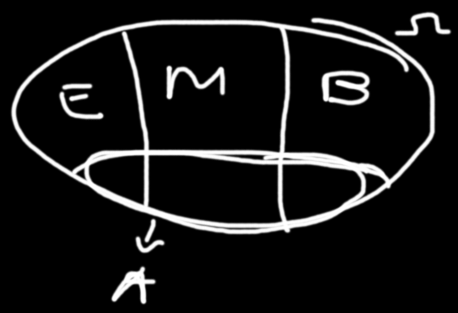

# **Apontamentos**

# Resoluções dos apontamentos

## 1. Probablidades

### **1.a**

Companhia de seguros

- Tendo o Venus:

    

Riscos de haver pelo menos 1 acidente:
-  baixo → 1%
-  medio → 10%
-  alto → 25%

Probablidade de ter um cliente de ter a classificacao:
- baixa → 0.1
- media → 0.6

agora considerando os acontecimentos:
- A : "ter pelo menos 1 acidente"
- B : ser um cliente classificado na categoria de baixo risco
- M : ser um cliente classificado na categoria de medio risco
- E : ser um cliente classificado na categoria de elevado risco

Logo as probablidades sao:
- $P(A/B)=0.01$
- $P(A/M)=0.1$
- $P(A/E)=0.25$
- $P(B)=0.1$
- $P(M)=0.6$
- Problema: $P(A) = ??$
- $P(E) = 0.3$

    Se: $P(\Omega) = P(B) + P(M) + P(E)$

    Então:

    $P(E)=P(\Omega)-( P(B) + P(M))\Leftrightarrow \\
    \Leftrightarrow P(E) = 1 - (0.1+0.6)\\
    \Leftrightarrow P(E) = 1 - (0.7) =0.3$

- Considerando que:
  
 

  Então podemos concluir que:

  $
  P(A) = P(A \cap M )+P(A \cap B )+P(A \cap E ) \\
  P(A) = 0.06 + 0.001 + 0.075 \\
  P(A) = 0.136
  $

    -   $P(A \cap M ) = 0.06$

        Pois:

        $P(A/M) = \frac{P(A \cap M )}{P(M)}\Leftrightarrow$

        $P(A \cap M )=P(A/M)·P(M)\Leftrightarrow$
        
        $\Leftrightarrow  P(A \cap M )=0.1·0.6=0.06$

    -   $P(A \cap B ) = 0.001$

        Pois:

        $P(A/B) = \frac{P(A \cap B )}{P(B)}\Leftrightarrow$

        $P(A \cap B )=P(A/B)·P(B)\Leftrightarrow$
        
        $\Leftrightarrow  P(A \cap B )=0.01·0.1=0.001$
    -   $P(A \cap E ) = 0.075$

        Pois:

        $P(A/E) = \frac{P(A \cap E )}{P(E)}\Leftrightarrow\\
        \Leftrightarrow P(A \cap E )=P(A/E)·P(E)\\
        \Leftrightarrow  P(A \cap E )=0.25·0.3=0.075$

**Resposta: $P(A) =0.2126$**

### **1.b**

**Problema: $P(E/A) = ??$**

$
P(E/A) = \frac{P(E \cap A )}{P(A)}\Leftrightarrow\\
P(E/A) = \frac{0.075}{0.136} = 0.5514705882352941 \approx 0.5515
$

### **1.c**

Problema: $P(E/ \overline{A})$

$
P(M/ \overline{A}) = P(M \cap \overline{A} )·P(\overline{A})\\
P(M/ \overline{A}) = (P(M)- P(M\cap A)) · (1- P(A))\\
P(M/ \overline{A}) = (0.6 - 0.06) · (1 - 0.136)\\
P(M/ \overline{A}) = 0.54 · 0.864\\
P(M/ \overline{A}) = 0.46656
$

$
P(E/ \overline{A}) = P(E \cap \overline{A} )/P(\overline{A})\\
P(E/ \overline{A}) = (P(\overline{A} / E  )·P(E))/P(\overline{A})\\
P(E/ \overline{A}) = ((1- P(A/E)) ·P(E))/(1-P(A))\\
P(E/ \overline{A}) = ((1-0.25) ·0.3)/(1-0.2126)\\
P(E/ \overline{A}) = 0.177165
$