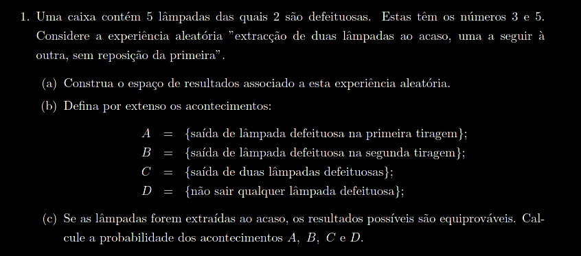
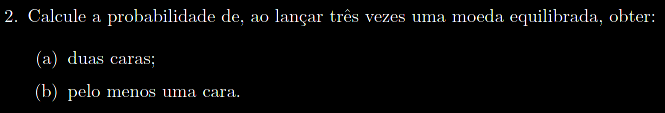
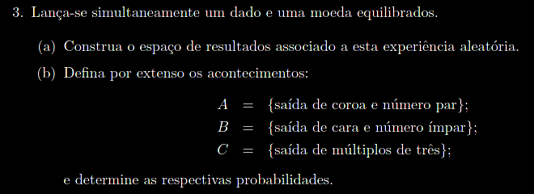
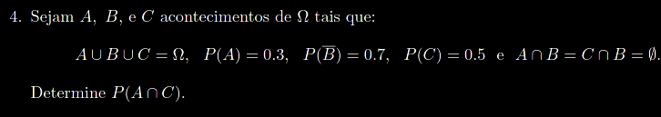
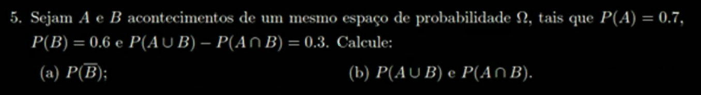
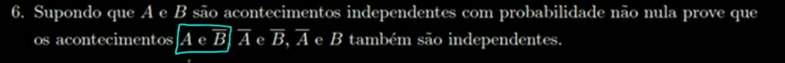
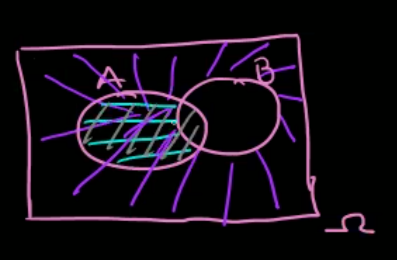
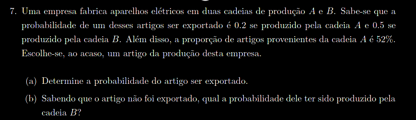

# **Pratica ME**

- [**Pratica ME**](#pratica-me)
- [Ficha](#ficha)
    - [1.](#1)
      - [a)](#a)
      - [b)](#b)
      - [c)](#c)
    - [2.](#2)
      - [a)](#a-1)
      - [b)](#b-1)
    - [3.](#3)
    - [4.](#4)
    - [5.](#5)
      - [a)](#a-2)
      - 
    - [6.](#6)
    - [7.](#7)
      - [b)](#b-2)
      - [b)](#b-3)

# Ficha 

### 1.

#### a)
 E - "extração de lâmpadas ao acaso, uma a seguir à outra, sem reposição da 1ª"

Todos os acontecimentos:

$\Omega=\\
\{\\
(1,2), (1,3), (1,4), (1,5),\\
(2,1), (2,3), (2,4), (2,5),\\
(3,1), (3,2), (3,4), (3,5),\\
(4,1), (4,2), (4,3), (4,5),\\
(5,1), (5,2), (5,3), (5,4)\\ 
\}$

#$\Omega$ = 20

#### b)
 $A = \{\\
  (3,1), (3,2), (3,4), (3,5),\\
 (5,1), (5,2), (5,3), (5,4)\\
 \}$

 #A = 8

$B = \{\\
(1,3),(2,3),(4,3),(5,3),\\
(1,5),(2,5),(3,5),(4,5)\\
\}$

#B = 8

$C=\{(3,5),(5,3)\}$

#C = 2

$D=\{$\Omega=\\
\{\\
(1,2),  (1,4), \\
(2,1),  (2,4), \\
(4,1), (4,2), \\
\}$

#D = 6

#### c)

$P(A) = 8/20 = 2/5 = 0,4$

$P(B) = 8/20 = 2/5 = 0,4$

$P(C) = 2/20 = 1/10 = 0,1$

$P(D) = 6/20 = 3/10 = 0,3$

---
### 2.

#### a)

$$

#### b)

---
### 3.

Ca - "sair cara na moeda"

k - "sair coroa na moeda"

$\Omega = \{\\
 (1,Ca), (1,K),\\ (2, Ca), (2, k),\\ (3,Ca), (3,k),\\ (4,Ca), (4,k),\\ (5, Ca), (5,k),\\ (6,Ca), (6,k)\\
\}$

$A = \{(2,k),(4,k),(6,k)\}$

$P(A) = 3/12 = 1/4 = 0,25$

$B = \{(1,Ca),(3,Ca),(5,Ca)\}$

$P(B) = 3/12=1/4 = 0,25$

$C = \{(3,Ca),(3,k),(6,Ca),(6,k)\}$

$P(C) = 4/12 = 1/3$

---
### 4.

$P(A \cup B \cup C) = P(\Omega) = 1$

$P(\overline{B}) = 0,7 \Leftrightarrow 1 - P(B) = 0,7 \Leftrightarrow P(B) = 0,3$

$P(C) = 0,5$

$P(A \cap B) = P(C \cap B) = P(\cancel{0}) = 0$ 

$P(A \cap C) = ?$

$P(A \cup B \cup C) = P(A)+P(B) + P(C) - P(A \cap B) - P(A\cap C )-P()B\cap C)+P(A\cap B \cap C) \Leftrightarrow\\
1 = 0,3 + 0,3  + 0,5 - 0 - P(A \cap C) - 0 + 0 \Leftrightarrow \\
P(A \cap C) =- 1 + 0,3 +0,3 + 0,5 - 0 - 0 + 0 \Leftrightarrow\\
P(A \cap C) = 0,1$

---
### 5.

#### a)
 $P(\overline{B}) = 1 - P(B) =  1-0,6 = 0,4$

#### 
b) $P(A\cup B) - P(A \cap B ) = 0,3 \Leftrightarrow P(A) + P(B) - P(A \cap B) - P(A \cap B ) = 0,3 \Leftrightarrow\\
0,7+0,6-2P(A \cap B) = 0,3 \Leftrightarrow\\
P(A\cap B) = 0,5$

$P(A \cup B) - P(A \cap B) = 0,3 \Leftrightarrow\\
P(A \cup B) - 0,5 = 0,3 \Leftrightarrow\\
P(A \cup B) = 0,8$

---
### 6.

A e B sao independentes logo $P(A \cap B) = P(A) \times P(B)$

$P(A \cap \overline{B}) =\\
 P(A) - P(A \cap B) =\\
 P(A) - P(A) \times P(B) =\\
 P(A) \times (1-P(B)) =\\
 P(A) \times P(\overline{B})$

$A$ e $\overline{B}$ são independentes

---
### 7.

2 cadeiras de producao A e B

Acontecimentos:

A - "o artigo é ser produzido pela cadeira A"

E - "o artigo é ser exportado"

$P(E / A) = 0,2$

$P(E / \overline{A}) = 0,5$

$P(A) = 52\% = 0,52$

#### b)

$P(\overline{A}) =100\% - 52\% =1 - 0,52 = 0,48$

$P(E) = ?$

$P(A/B) = \cfrac{P(A\cap B)}{P(B)}$

 $$\ $$
 
$P(E/A) = \cfrac{P(E\cap A)}{P(A)} = 0,2 \Leftrightarrow\\
 P(E\cap A ) = 0,2 \times 0,52 \Leftrightarrow\\
 P(E\cap A ) = 0,104$
 
 $$\ $$
 
 $P(E/\overline{A})= 0,5 \Leftrightarrow\\
 \cfrac{P(E/\overline{A})}{P(\overline{A})} = 0,5 \Leftrightarrow\\
 P(E\cap \overline{A}) = 0,5 \times 0,48 \Leftrightarrow\\
 P(E\cap \overline{A}) = 0,24$

 _Teorema da probabilidade total_:

 $P(E) = P(E \cap A) + P(E \cap \overline{A}) = 0,104 +0,24 = 0,344$

 R: A probabilidade do artigo ser exportado é de 0,344. 

#### b)

$P(\overline{A}/\overline{E}) = ?$

_precisamos do $P(\overline{A} \cap \overline{E})$ para obter pois :_
$P(\overline{A}/\overline{E}) = \cfrac{P(\overline{A} \cap \overline{E})}{P(E)}$

_revendo alguns numeros_:

$P(E \cap \overline{A}) = 0,24$

$P(E / \overline{A}) = 0,5$

$P(\overline{E} / \overline{A}) =1 - P(E / \overline{A}) = 1 -0,5 = 0,5$

$P(\overline{E} / \overline{A}) = P(\overline{A} \cap \overline{E}) / P(A) \Leftrightarrow\\
P(\overline{A} \cap \overline{E}) =  P(\overline{E} / \overline{A}) \times P(A)\Leftrightarrow\\
P(\overline{A} \cap \overline{E}) = 0,5 \times 0,52 = 0,26$

com os dois valores:

$P(\overline{A}/\overline{E}) = \cfrac{P(\overline{A} \cap \overline{E})}{P(E)} \Leftrightarrow\\
P(\overline{A}/\overline{E}) = \cfrac{0,26}{0,344} = 0,7558139534883721 \approx 0,755$