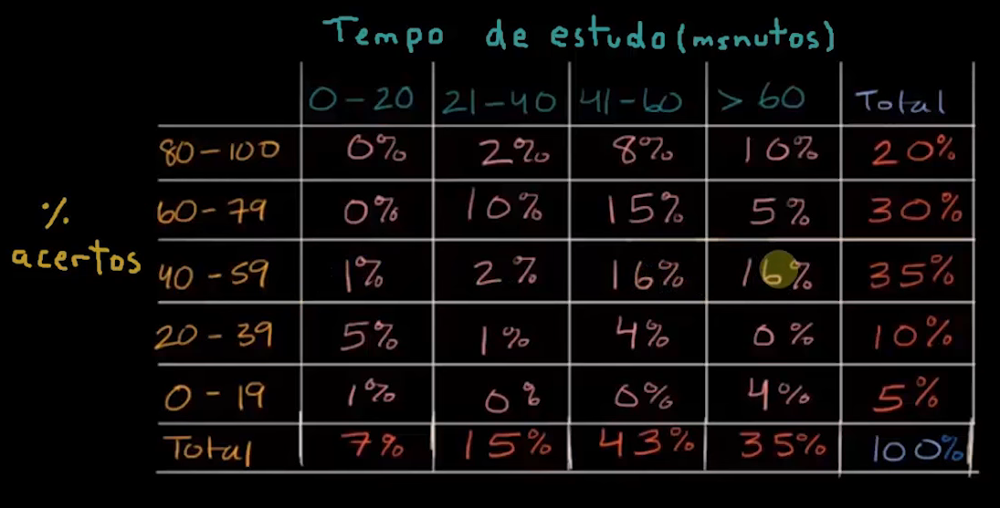
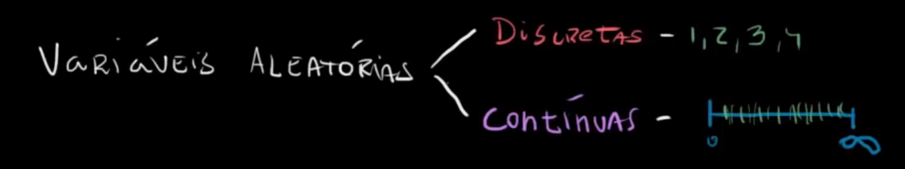

# Teorica de ME

## Probablidades - Teoremas e Axiomas

### Teoremas de probablidades
Considera *A* e *B* acontecimentos de um universo $\Omega$

Seja $\Omega$ o universo de resultados associados a uma experiência aleatória.

Sejam *A* e *B* dois acontecimentos ($A\subset \Omega$ e $B \subset \Omega$).

Teoremas:
> $P(\bar{A})= 1-P(A)$

> $P(\bar A) = 1 - P(A) \Leftrightarrow P(\bar A) + P(A) = 1$

> $P(\empty) = 0$

> $P(A) \leq 1$

> $P(A \cup B) = P(A) + P(B) - P(A \cap B)$

> $P(A \cap \bar B) + P(A \cap B) = P(A) $

Ficando assim com os Axiomas principais:

Axioma 1:

$$
P(A) \geq 0, \forall A \in 
$$

### Probablidade do acontecimento impossível

Teorema:

> $P(\empty)=0$

> $P(\Omega)=1$ 

### Probablidade do acontecimento complementar

Seja A um acontecimento de um universo de resultados $\Omega$
> $P(\bar A)=1-P(A)$

## Distrubuição marginal e distribuição condicional

Perguntas a fazer nesta tabela:
> Qual é a percentagem de acertos e os tempos que ficaram a estudar?

 é a distribuição marginal. Marginal, sendo as probablidades laterais.

As probablidades condicionais são aquelas que tem condições, por exemplo os valores que estao no meio da tabela.

## Varíaveis aleatórias: discretas e contínuas

Discretas: sao contaveis.

Continuas: infinitas.