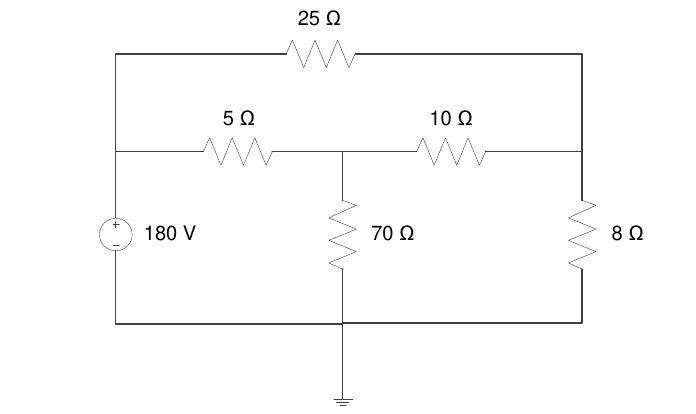
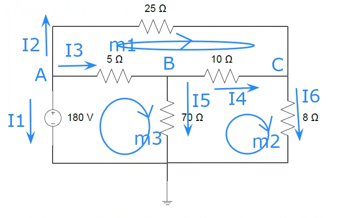
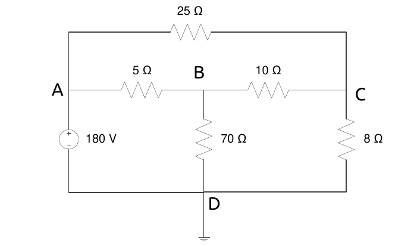
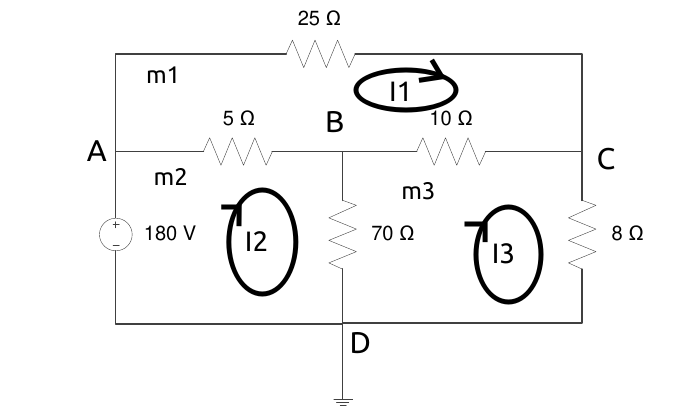
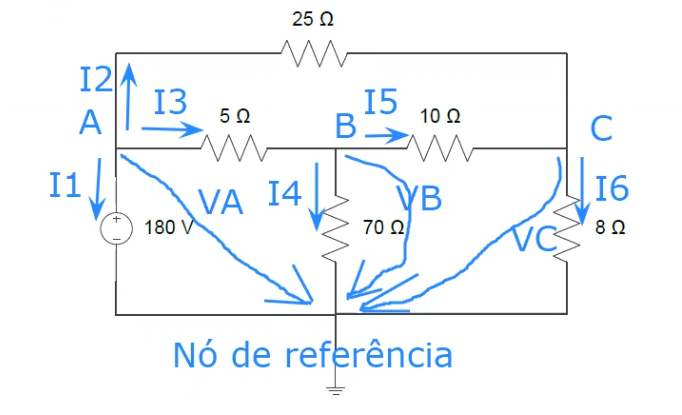

# Estudo de Eletro

## Aula 4

### Ex 8

#### a) Metodo direto

##### **I**. Identificar nós essenciais

Existem 4 nós essenciais

##### **II**. Aplicar a lei dos nós a n-1 nós essenciais

| Nó | Expressão |
|------|:-----------------:|
| A |  I1 + I2 + I3 = 0 |
| B | I3 = I5 + I4 |
| C | I2 + I4 = I6 |

##### **III**. Aplicar a lei das malhas às malhas simples

| malha | Expressão |
|------|:-----------------:|
| m1 |  25·I2 - 10·I4 - 5·I3 = 0 |
| m2 | 10·I4 + 8·I6 - 70·I5 = 0 |
| m3 | 70·I5 - 180 + 5·I3 = 0 |


##### **IV.** Fazer a matriz conjunta

| I1 | I2 | I3 | I4 | I5 | I6 |  |
|:--:|:--:|:--:|:--:|:--:|:--:|:--:|
| 1·I1 | 1·I2 | 1·I3 | 0 | 0 | 0 | = 0 
| 0 | 0 | -1·I3 | 1·I4 | 1·I5 | 0 | = 0 
| 0 | 1·I2 | 0 | 1·I4 | 0 | -1·I6 | = 0 
| 0 | 25·I2 | -5·I3 | -10·I4 | 0 | 0 | = 0 
| 0 | 0 | 0 | 10·I4 | -70·I5 | 8·I6 | = 0 
| 0 | 0 | 5·I3 | 0 | 70·I5 | 0 | = 180 

##### **V.** Meter tudo no scilab/matlab/octave

**Setup dos dados:**

```octave
A = [ 
  1 1 1 0 0 0
  0 0 -1 1 1 0 
  0 1 0 1 0 -1  
  0 25 -5 -10 0 0 
  0 0 0 10 -70 8 
  0 0 5 0 70 0
]

 b = [0;0;0;0;0;180]
```

**Como obter os resultados:**

A \* x  = b <=>, sendo x as incognitas I*X* como I1, I2 etc

<=> x = b / A

<=> x = 1 / A \* b

<=> x = A^(-1) * b


logo na formula da calculadora escrevemos `A^-1 * b`

e assim obtemos:

I1 = -12

I2 = 4

I3 = 8

I4 = 6

I5 = 2

I6 = 10

##### **VI.** Solução

P = V·I1 = 180·I1 = 180·12 = 2160W = 2.16 kW

#### b) Metodo das malhas

##### **I.** Identificar as malhas simples


##### II. Identificar correntes fictícias (correntes de malha)


##### III. Aplicar a lei das malhas às malhas simples

m1 : 25·I1 + 10·(I1-I3) + 5·(I1 - I2) = 0

m2: 5·(I2 - I1) + 70·(I2 - I3) - 180 = 0
 
m3: 10·(I3 - I1) + 8·(I3) + 70·(I3 - I2) = 0

| I1 | I2 | I3 | |
|:-:|:-:|:-:|:-:|
|25+10+5(40) | - 5 | - 10 | = 0
| -5 | 5+70(75) | -70 | = 180
| -10 | -70 | 10+8+70(88) | = 0

##### IV. Calculos

```octave
A = [
   40 -5 -10 
   -5 75 -70 
   -10 -70 88 
] 

b = [0;180;0]

resultado = A^-1 * b
```

###### Resultados
```octave
 resultado  = 

   4. 
   12.
   10.
```

I1 = 4A
I2 = 12A
I3 = 10A

P = -V·I2 = -180 · 12 = -2160W = -2.16kW

#### c) Metodo das tensões nodais

##### I. Identificar nós essenciais


##### II. Identificar nó de referência (nó com + ligações)
É o nó D.

##### III. Identificar tensões nodais (quedas de tensão dos nós essenciais não de referência para o nó de referência)


##### IV. Aplicar a lei dos nós aos nós essenciais não de referência



Nó A: I1 + I2 + I3 = 0
Nó B: I3 = I5 + I4
Nó C: I5 + I2 = I6

##### V. Relacionar as correntes com as tensões nodais (Lei das malhas)

I1 = ? → VA = 180


25 · I2 + VC - VA = 0 →  I2 = ( VA - VC ) / 25

5 · I3 + VB - VA = 0 → I3 = ( VA - VB ) / 5

I4 = VB / 70

10 · I5 + VC - VB = 0 → I5  = ( VB - VC ) /  10

I6 = VC / 8
